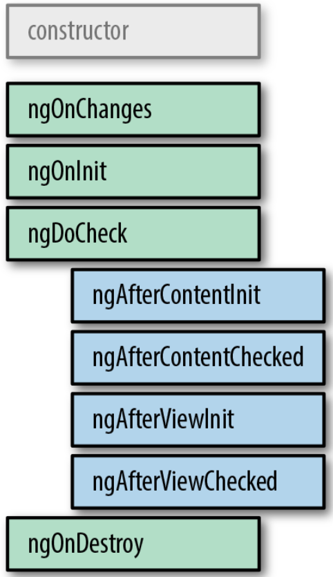

1. ¿Cuáles son los style encapsulation de los componentes? Pon un ejemplo
de uso de cada uno de ellos.
    Como principio basico, Angular no relaciona los estilos especificados en un componente con los demás componentes si no se especifica expresamente. Utilizando el código "encapsulation: ViewEncapsulation.<Elemento>", Angular tiene tres opciones para modificar este comportamiento:
    - ShadowDom: 
    - Emulated: 
    - None: 

2. ¿Qué es el shadow DOM?
   La API Shadow DOM es la parte de la encapsulacion web que se encarga de mantener oculto a un elemento, manteniendo la estructura de marcado, el estilo y el comportamiento ocultos y separados de otros códigos en la página para que las diferentes partes no entren en conflicto y el código se pueda mantener limpio y ordenado.

3. ¿Qué es el changeDetection?
   En changeDetection de Angular es el encargado de realiza la detección de cambios en cada componente desde el pie a la cabeza, cada vez que se realiza algo. Un problema de este metodo es que al hacerse la aplicación compleja, este proceso se vuelve muy pesado.

4. ¿Qué diferencias existen entre las estrategias Default y OnPush? ¿Cuándo
debes usar una y otra? Ventajas e inconvenientes.
    A traves del Change​DetectionStrategy, Angular nos permite decidir cuando y cuando actualizar la interfaz de usuario. A trebés del parámetro Default, Amazon actualiza la interfaz cada vez que se detecta algun cambio, opcion por defecto. Por contra, a través de OnPush, Angular solo lo hara si se indica expresamente.
    Este cambio (De Default a OPush) se deve aplicar en el momento que la aplicación crezca tanto que no sea sostenible que se actualize toda la interfaz de usuario y sea más acertado solo actualizar partes en concreto.
    La principal vetaja de actualizar toda la aplicación por defecto es que todos los parámetros se actualizan cuando hay un cambio, pero si el volumen de la aplicacón es considerable, el tiempo de renderizado puede ser notable. Por contra, actualizar solo los puntos indicados puede disminuir muho el tiempo de renderizado, pero podemos tener partes que no se actualizen de una forma adecuada.

5. Explica con detalle el ciclo de vida de los componentes. Haz hincapié en cuándo se disparan los hooks OnChanges, OnInit, AfterViewInit y OnDestroy, puesto que son los más utilizados.
    Hay 8 etapas diferentes en el ciclo de vida de los componentes. Cada etapa se denomina lifecycle hook event o en ‘evento de enlace de ciclo de vida’. Podemos utilizar estos eventos en diferentes fases de nuestra aplicación para obtener el control de los componentes. Como un componente es una clase de TypeScript, cada componente debe tener un método constructor.
    El constructor de la clase de componente se ejecuta primero, antes de la ejecución de cualquier otro lifecycle hook. Si necesitamos inyectar dependencias en el componente, el constructor es el mejor lugar para hacerlo. Después de ejecutar el constructor, Angular ejecuta sus métodos de enganche de ciclo de vida en un orden específico.
    Estas etapas están divididas principalmente en dos fases, una vinculada al componente en si y la otra vinculada a los hijos del componente.
    Revisemos cada uno de los eventos:
    
    - ngOnChanges: Este evento se ejecuta cada vez que se cambia un valor de un input control dentro de un componente. Se activa primero cuando se cambia el valor de una propiedad vinculada. Siempre recibe un change data map o mapa de datos de cambio, que contiene el valor actual y anterior de la propiedad vinculada envuelta en un SimpleChange
    - ngOnInit: Se ejecuta una vez que Angular ha desplegado los data-bound properties(variables vinculadas a datos) o cuando el componente ha sido inicializado, una vez que ngOnChanges se haya ejecutado. Este evento es utilizado principalmente para inicializar la data en el componente.
    - ngDoCheck: Se activa cada vez que se verifican las propiedades de entrada de un componente. Este método nos permite implementar nuestra propia lógica o algoritmo de detección de cambios personalizado para cualquier componente.
    - ngAfterContentInit: Se ejecuta cuando Angular realiza cualquier muestra de contenido dentro de las vistas de componentes y justo después de ngDoCheck. Actuando una vez que todas las vinculaciones del componente deban verificarse por primera vez. Está vinculado con las inicializaciones del componente hijo.
    - ngAfterContentChecked: Se ejecuta cada vez que el contenido del componente ha sido verificado por el mecanismo de detección de cambios de Angular; se llama después del método ngAfterContentInit. Este también se invoca en cada ejecución posterior de ngDoCheck y está relacionado principalmente con las inicializaciones del componente hijo.
    - ngAfterViewInit: Se ejecuta cuando la vista del componente se ha inicializado por completo. Este método se inicializa después de que Angular ha inicializado la vista del componente y las vistas secundarias. Se llama después de ngAfterContentChecked. Solo se aplica a los componentes.
   - ngAfterViewChecked: Se ejecuta después del método ngAfterViewInit y cada vez que la vista del componente verifique cambios. También se ejecuta cuando se ha modificado cualquier enlace de las directivas secundarias. Por lo tanto, es muy útil cuando el componente espera algún valor que proviene de sus componentes secundarios.
    - ngOnDestroy: Este método se ejecutará justo antes de que Angular destruya los componentes. Es muy útil para darse de baja de los observables y desconectar los event handlers para evitar memory leaks o fugas de memoria.

